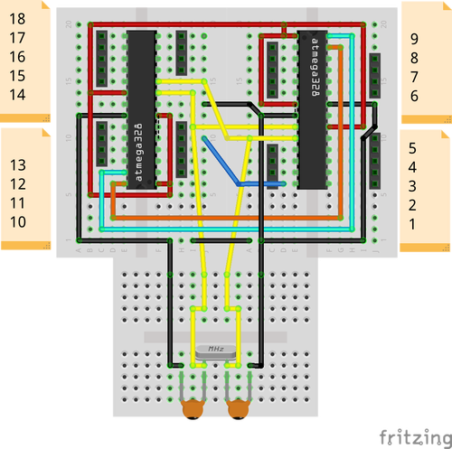
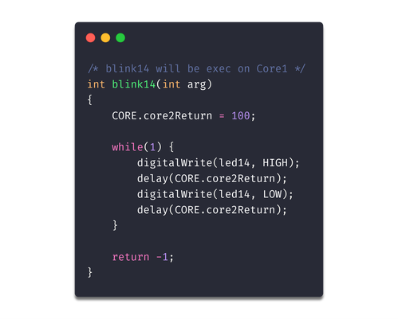
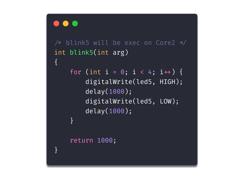
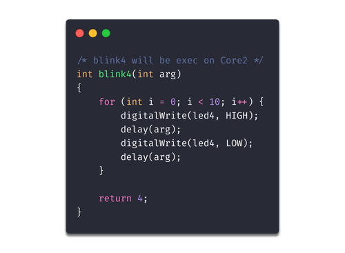
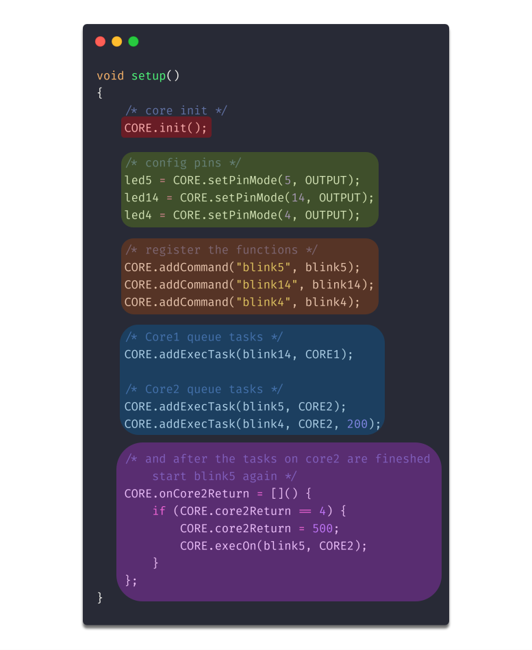

# Miduecore - Dual Core Arduino Prototype

Este é o meu prototipo de Arduino Dual core:

<center>
	
</center>

Dois ATMega328P utilizando a mesma fonte de energia e clock.
Para intercomunicação utiliza I2C e interrupções para avisar o núcleo mestre
que há dados a serem compartilhados.

## Compilação

Para o desenvolvimento do código do projeto estou utilizando o Visual Studio
Code com a extensão do PlatformIO.

## Flash

Utilize um programador USBasp.

Para o correto funcionamento da aplicação temos que definir um dos
microcontroladores como sendo o Master, núcleo 1. Ele que terá o poder de
requisitar que novas tarefas sejam executadas no núcleo 2.

Para flashar um microcontrolador como master utilize o comando:

```bash
avrdude -v \
	-patmega328p \
	-cusbasp \
	-Pusb \
	-Uflash:w:.pioenvs/uno/firmware.hex:i \
	-Ueeprom:w:scripts/eeprom.hex:i
```

Para flashar um microcontrolador como slave utilize o comando:

```bash
avrdude -v \
	-patmega328p \
	-cusbasp \
	-Pusb \
	-Uflash:w:.pioenvs/uno/firmware.hex:i
```

Lembrando que os dois microcontroladores terão o mesmo código, a única coisa
que os difere é um número mágico inserido na EEPROM do núcleo que funcionará
como Master.

## SDK

Para a programação transparente dos microcontroladores um SDK foi desenvolvido.
Assim deixando o programador com a sensação de estar desenvolvendo para um
dispositivo único.

* **CORE.init()**
	* In this method the EEPROM is checked and the firmware discovers
	if it is running on core1 or core2. It also initialize interrupts and
	I2C connections between cores.

* **CORE.setPinMode(pin, mode)**
	* We can use pins of the two cores. So instead of using the standard pinMode function of the Arduino library, this method was implemented. Under the table it converts the "dual core" numbering to the actual core pin numbering. Another important point is that the pinMode must be executed in the actual core where the pin is, so this method also includes the pinMode to the pin core task queue.

* **CORE.addCommand("function", function)**
	* This method registers the function pointer and the string of its name to a hashmap inside the SDK. So, core1 can for example send the name of a function, in string, via I2C to be executed by core2, which will fetch the function pointer in its hashmap by name. It is at this point that there is the advantage of having the same firmware on both microcontrollers. The programming of the cores becomes transparent because the two microcontrollers have the same functions. The SDK user gets the feeling of programming for a single device.

* **CORE.addExecTask(function, core, argument)**
	* This method adds the pointer of a function to the task queue of a given core passed as parameter: *CORE1* or *CORE2*. The method expects us to pass a function with the signature *void name(int argName)* so we can still pass a last argument, of integer type, to this method that will be the argument passed when the task exits the queue and executes. Important: use this method only inside *setup()* because it does not intercommunicate between cores. Inside *setup()* it is useful, so with that we can already include tasks in the execution queues of the cores during "boot".

* **CORE.onCore2Return**
	* This property expects to receive a function pointer, or a lambda expression, which will be executed when core2 has returned, triggered the interruption of core1, from some task/function with return value other than -1.

* **CORE.execOn(function, core)**
	* This method adds a function to the task queue of a given core, passed as a parameter: *CORE1* or *CORE2*. The difference here, related to *CORE.addExecTask*, is that this method should be used outside the scope of *setup()*.

* **CORE.exec()**
	* This method runs the task queue of each core on which it will be running. Always leave this method inside the *loop()* because when the core is free, that is, it has performed all its tasks, it is always checking for new tasks sent to the queue.

## Exemplo

Nesse repositório temos um exemplo da utilização do SDK para o Arduino Dual Core.

Cada função é uma tarefa e o valor retornado da função, se for diferente de -1,
será compartilhado entre os núcleos.

<center>
	
</center>

<center>
	
</center>

<center>
	
</center>


Com as funções/tarefas definidas podemos utilizar o SDK para montar filas de
execução, também podemos dizer em qual core cada tarefa será executada:

<center>
	
</center>

### Example in action

<iframe width="560" height="315"
	src="http://youtu.be/cl0sgdi3blo" 
	frameborder="0" 
	allow="accelerometer; autoplay; encrypted-media; gyroscope; picture-in-picture" 
	allowfullscreen>
</iframe>
